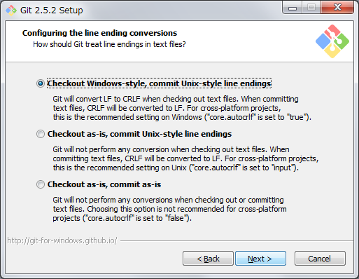

# Git のインストールマニュアル (Windows 編)

## msysGit のインストール

Windows に Git をインストールするには msysGit を使用する。

1. [git for Windows](https://git-for-windows.github.io/) のサイトから最新バージョン (執筆時点では 2.5.2 が最新) のインストーラーをダウンロードする。
2. インストーラーを実行し、インストールを開始する。
3. 改行コード変換設定のオプション選択で、「CRLF でのチェックアウト + LF でのコミット」のオプションを選択する。その他のオプションについては状況に応じて適切に選択する。

4. 正常にインストールされたことを確認する。
```
# git version
git version 2.5.2.windows.1
```
バージョンが表示されれば成功。
5. 改行コード変換の設定を確認する。
```
# git config --global --list
... (省略) ...
core.autocrlf=true
... (省略) ...
```

## 初期設定

ここで設定したユーザー名、メールアドレスはコミット履歴として残るため重要。

1. ユーザー名を設定する。
```
# git config --global user.name "<ユーザー名>"
```
2. メールアドレスを設定する。
```
# git config --global user.email "<メールアドレス>"
```
3. ターミナルの出力が色付けされるように設定する。
```
# git config --global color.ui auto
```
4. 設定内容を確認する。
```
# git config --global --list
... (省略) ...
user.name=<ユーザー名>
user.email=<メールアドレス>
color.ui=auto
... (省略) ...
```

## SSH キーの生成

GitHub (クローン) などのリポジトリにアクセスするためには SSH キーが必要となる。

1. SSH キーを生成する。-C オプションは任意のコメント用だが、メールアドレスを指定するのが一般的のようである。
```
# ssh-keygen -t rsa -b 4096 -C "<メールアドレス>"
```
2. `%HOME%\.ssh` に以下のファイルが作成されていることを確認する。
  * id_rsa
  * id_rsa.pub

## Appendix

### Git の設定の影響範囲

`git config ` による設定時にオプションを指定することで設定範囲を指定することができる。

* `--system `: システム上の全ユーザーの全リポジトリ向けの設定。  
設定ファイルの位置はインストールディレクトリの `\mingw64\etc\gitconfig`。
* `--global`: 各ユーザーごと全リポジトリ向けの設定。  
設定ファイルの位置は `%HOME%\.gitconfig`。
* `--local`: リポジトリ (コマンド実行位置) 専用の設定。  
設定ファイルの位置はリポジトリのルート `\.gitconfig`。
