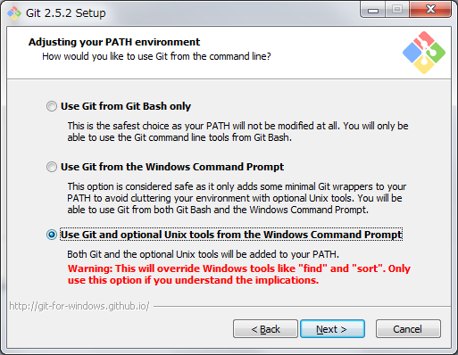
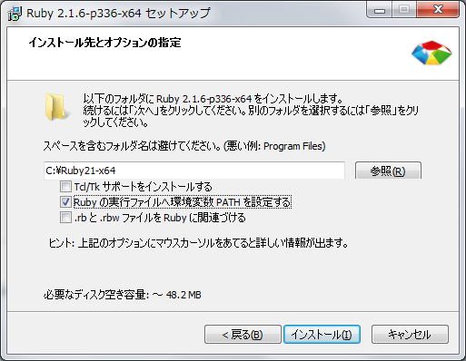

# Windows での Chef、knife-zero のインストールマニュアル

## ssh コマンドのインストール

knife-zero の内部では ssh コマンドが使用される。Windows のコマンドプロンプトには ssh コマンドが存在しないのでインストールが必要。ssh コマンドのインストール方法はいくつかあるが、ここでは msysgit をインストールする方法を説明する。

1. git for Windows のサイトから最新バージョン (執筆時点では 2.5.2 が最新) のインストーラーをダウンロードする。
2. インストーラーを実行し、インストールを開始する。以降の手順では ssh コマンドをインストールするに当たっての重要なインストールオプションについてのみ説明する。その他のオプションについては、個々の状況に応じて適切に選択する。
3. 環境変数 PATH 設定のオプション選択で、コマンドプロンプトから Unix ツールを使えるようにするためのオプションを選択する。

4. 正常にインストールされたことを確認する。
```
ssh
```
エラーがでなければ成功。

## Windows への Ruby のインストール

knife-zero は Ruby 製のツールなので Ruby をインストールする必要がある。

### Ruby のインストール

**注意！:**

基本的には最新のバージョンをインストールすればよいが、執筆時点では2.2系の Ruby と1.8系の knife-zero の組み合わせでは正常に動作しなかったため、2.1 系の Ruby をインストールした。

1. 最新の RubyInstaller (執筆時点では 2.1.6) をダウンロードする。
2. インストーラーを実行し、インストールを開始する。以降の手順では必須のオプションについてのみ説明する。その他のオプションについては、個々の状況に応じて適切に選択する。
3. インストール先とオプションの指定で、環境変数 PATH の設定を選択する。

4. 正常にインストールされたことを確認する。
```
ruby -v
```
以下のように表示されれば成功。
```
ruby 2.1.6p336 (2015-04-13 revision 50298) [x64-mingw32]
```

### DevKit のインストール

Native 拡張ライブラリーを使用するため DevKit をインストールする必要がある。

1. RubyInstaller のサイトから DevKit をダウンロードする。
2. 自己解凍形式のファイルなので任意のフォルダに解凍する。
3. DevKit をインストールする。Ruby を再インストールした場合は再度以下のコマンドを実行する必要がある。
```
cd /path/to/devkit
ruby dk.rb init
ruby dk.rb install
```

### Bundler のインストール

chef、knife-zero はプロジェクトごとに管理すべきライブラリなので Bundler で管理する。

gem で Bundler をグローバルにインストールする。

```
gem install bundler
```

## chef、knife-zero のインストール

Chef を使用するプロジェクトごとに chef、knife-zero をインストールする。

1. プロジェクトのルートフォルダで `bundler init` して Gemfile を作成する。
2. Gemfile をテキストエディタで開き、以下の設定を追加する。バージョンは執筆時点で安定していたもの。
```
gem 'chef', '~> 11.18.12'
gem 'knife-zero', '~> 1.8.0'
```
Windows の場合、以下の設定も追加する。バージョンは執筆時点で最新のもの。
```
gem 'win32-process', '~> 0.8.1'
gem 'windows-pr', '~> 1.2.4'
gem 'win32-service', '~> 0.8.7'
```
3. 以下のコマンドでグローバルにインストールする。
```
bundle install
```
本当はグローバルを汚したくないので、プロジェクトのルートフォルダにインストールしたいところだが Bundler で win32-process、windows-pr、win32-service との依存関係がうまく解決できないようなのであきらめた。ちなみに、プロジェクトのルートフォルダへは以下のコマンドでインストールできる。
```
bundle install --path vendor/bundle --binstubs /.bundle/bin
```
4. インストールが正常に行われたことを確認する。
```
knife -v
```
以下のような結果が表示されれば成功。
```
Chef: 11.18.12
```

## knife-zero の使用例

Vagrant 上の仮想マシンにプロビジョニングする例。

**注意！:**
Windows から Linux にプロビジョニングする場合、Linux サーバーに送るファイルなどの改行コードを LF にしておかないとトラブルのもと。特に Git でファイル管理している場合は `core.autocrlf=true` に設定してあることが多く、その場合チェックアウトしたファイルは改行コードが CRLF になってしまう。

1. プロジェクトのルードフォルダへ移動する。
```
cd /path/to/project
```

2. ノードに対してChefを実行する前準備をする。
```
knife zero bootstrap 192.168.33.10 -x vagrant -P vagrant --sudo
```

3. ノード名を確認する
```
knife node list
```
以下のように表示される。
```
vagrant-ubuntu-trusty-64
```

4. ノードにプロビジョニングしたい Cookbook (ここでは docker) を追加する。
```
knife node run_list add vagrant-ubuntu-trusty-64 docker
```

5. プロビジョニングを実行する。
```
knife zero chef_client 'name:*' -a knife_zero.host -x vagrant -P vagrant --sudo
```
